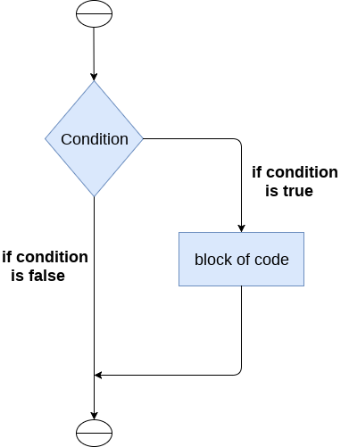

# Decision Making in Python

In Python, decision-making refers to the process of executing different code blocks based on certain conditions. This is typically achieved using conditional statements such as `if`, `elif` (else if), and `else`. Decision-making allows programs to make choices and execute specific actions based on the evaluation of conditions.

## 1. if Statement

The `if` statement is used to execute a block of code if a specified condition is true.

<p align="center">
  
</p>
<h3>Example:</h3>

```python

x = 10

if x > 5:
    print("x is greater than 5")
```

## 2. if-else Statement

The if-else statement is used to execute one block of code if the condition is true and another block if the condition is false.

<p align="center">
  
</p>
<h3>Example:</h3>
```python
x = 3

if x % 2 == 0:
    print("x is even")
else:
    print("x is odd")

```


