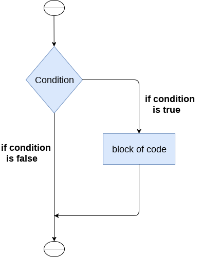
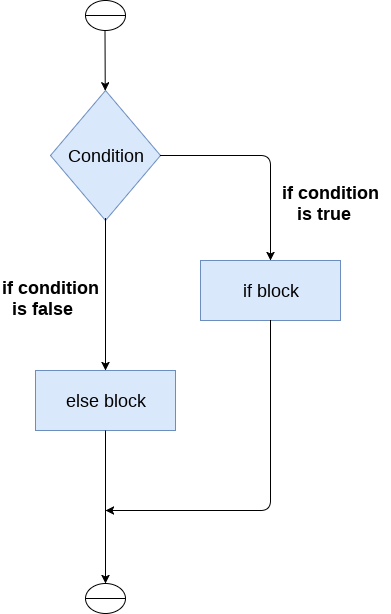
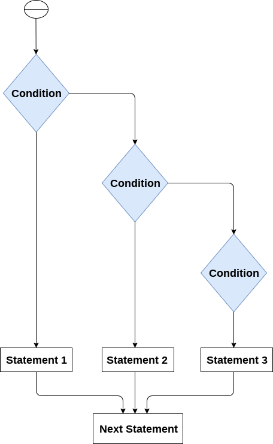

# Decision Making in Python

In Python, decision-making refers to the process of executing different code blocks based on certain conditions. This is typically achieved using conditional statements such as `if`, `elif` (else if), and `else`. Decision-making allows programs to make choices and execute specific actions based on the evaluation of conditions.

## 1. if Statement

The `if` statement is used to execute a block of code if a specified condition is true.

<p align="center">
  
</p>
<h3>Example:</h3>

```python

x = 10

if x > 5:
    print("x is greater than 5")
```

## 2. if-else Statement

The if-else statement is used to execute one block of code if the condition is true and another block if the condition is false.

<p align="center">
  
</p>
<h3>Example:</h3>

```python
x = 3

if x % 2 == 0:
    print("x is even")
else:
    print("x is odd")

```
## 3. elif statement

The elif statement enables us to check multiple conditions and execute the specific block of statements depending upon the true condition among them. We can have any number of elif statements in our program depending upon our need. However, using elif is optional.

<p align="center">
  
</p>
<h3>Example:</h3>

```python
x = 20

if x < 0:
    print("x is negative")
elif x == 0:
    print("x is zero")
else:
    print("x is positive")
```
## 4. Nested if-else statement

Conditional statements can be nested within each other to handle more complex decision-making scenarios.

<h3>Example:</h3>

```python
x = 10

if x > 0:
    if x % 2 == 0:
        print("x is a positive even number")
    else:
        print("x is a positive odd number")
else:
    print("x is not a positive number")
```
## 5. Ternary Operator

Python also supports a ternary operator, which provides a more concise way of writing simple conditional expressions.

<h3>Example:</h3>

```python
x = 10
result = "even" if x % 2 == 0 else "odd"
print("x is", result)
```


